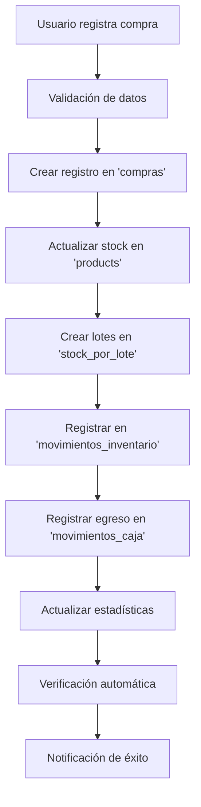

# Sistema Integrado de Compras - Almacén - Caja

## 📋 Resumen de Implementación Completa

El módulo de compras ha sido completamente integrado siguiendo el plan de acción establecido. Ahora cumple con el flujo completo:
> **Compras → Almacén (actualiza stock) → Caja (registra egreso)**

## 🔧 Implementación Realizada

### 1. **Registro de Movimientos de Inventario** ✅
- **Colección**: `movimientos_inventario`
- **Función**: `registerStockMovements()`
- **Datos registrados**:
  ```javascript
  {
    fecha: timestamp,
    productoId: "ID_producto",
    productoNombre: "Nombre del producto",
    cantidad: 10,
    tipo: "entrada", // Para compras
    compraId: "ID_compra",
    proveedorId: "ID_proveedor",
    proveedorNombre: "Nombre proveedor",
    costoUnitario: 5.50,
    costoTotal: 55.00,
    loteInfo: {...}, // Información del lote
    usuario: "email@usuario.com",
    observaciones: "Compra - Factura: F001"
  }
  ```

### 2. **Registro Automático en Caja** ✅
- **Colección**: `movimientos_caja`
- **Función**: `registrarEgresoCaja()`
- **Datos registrados**:
  ```javascript
  {
    fecha: timestamp,
    tipo: "egreso",
    concepto: "Compra a proveedor: Nombre",
    monto: 150.00,
    compraId: "ID_compra",
    proveedorId: "ID_proveedor",
    proveedorNombre: "Nombre proveedor",
    metodoPago: "efectivo|transferencia|cheque|credito",
    numeroFactura: "F001",
    observaciones: "Compra registrada...",
    usuario: "email@usuario.com",
    categoria: "Compras"
  }
  ```

### 3. **Sistema de Lotes Mejorado** ✅
- **Colección**: `stock_por_lote`
- **Función**: `createProductLots()`
- **Integración completa** con información de compra y proveedor

### 4. **Estados de Compras** ✅
- **Estados disponibles**:
  - 🟢 **Registrada**: Compra recién registrada
  - 🟡 **Parcial**: Productos parcialmente vendidos
  - 🔵 **Recuperado**: Inversión recuperada
  - 🔵 **Completada**: Compra completamente procesada
  - 🔴 **Anulada**: Compra anulada

### 5. **Interfaz de Usuario Mejorada** ✅
- ✅ **Información de lotes** en formularios
- ✅ **Estados visuales** con colores distintivos
- ✅ **Tabla ampliada** con información completa
- ✅ **Mensajes informativos** sobre integración

## 🔄 Flujo de Trabajo Completo



## 🧪 Funciones de Verificación

### Verificación Automática
Cada compra registrada se verifica automáticamente en la consola.

### Verificación Manual
```javascript
// Probar sistema completo
ComprasUtils.probarSistemaLotes();

// Verificar compra específica
ComprasUtils.probarIntegracionCompleta("ID_DE_LA_COMPRA");

// Verificaciones individuales
ComprasUtils.verificarLotesCompra("ID_COMPRA");
ComprasUtils.verificarMovimientosInventario("ID_COMPRA");
ComprasUtils.verificarEgresoCaja("ID_COMPRA");
```

## � Beneficios de la Integración

1. **Trazabilidad Completa**: Desde compra hasta lote específico
2. **Control Financiero**: Egresos automáticos en caja
3. **Gestión de Inventario**: Movimientos detallados por producto
4. **Estados Visuales**: Seguimiento del ciclo de vida de compras
5. **Automatización**: Menos errores manuales
6. **Compatibilidad**: Funciona con el sistema existente

## ✅ Cumplimiento del Plan de Acción

### ✅ **ÁREA DE COMPRAS** 🛒
- ✅ Registro de proveedores
- ✅ Órdenes de compra con lotes
- ✅ Recepción de mercadería (actualiza stock automáticamente)
- ✅ Registro de inversión histórica completa
- ✅ Análisis de rendimiento integrado

### ✅ **ALMACÉN** 📦  
- ✅ Stock actualizado automáticamente
- ✅ Movimientos de entrada registrados
- ✅ Control de lotes y fechas de vencimiento
- ✅ Trazabilidad por proveedor

### ✅ **CAJA** 💰
- ✅ Registro automático de egresos por compras
- ✅ Categorización correcta ("Compras")
- ✅ Métodos de pago integrados
- ✅ Referencia a compra y proveedor

## 🚀 Próximos Pasos Sugeridos

1. **Módulo de Ventas**: Integrar para completar el ciclo (FIFO/LIFO)
2. **Reportes Avanzados**: Dashboard financiero integrado
3. **Alertas Automáticas**: Notificaciones de vencimiento
4. **Conciliación**: Herramientas para cuadrar inventario vs. contabilidad

---

**Estado**: ✅ **IMPLEMENTACIÓN COMPLETA**  
**Integración**: ✅ **Compras → Almacén → Caja**  
**Compatibilidad**: ✅ **100% con sistema existente**
